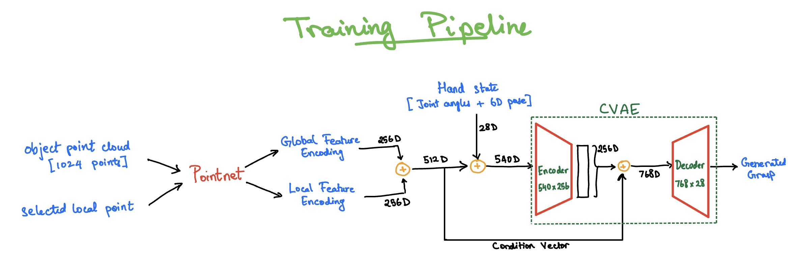

# DexLite: Replicating State-of-the-Art Dexterous Grasping (On a Budget)

> **Note:** This project is an implementation of the grasp synthesis methodology presented in the paper **Dex1B: Learning with 1B Demonstrations for Dexterous Manipulation**. The neural network architecture and energy functions described herein are based on their published work.

**Abstract:** This post details my journey building DexLite, a learning-based system for synthesizing dexterous grasps on a Shadow Hand. By adapting the massive-scale Dex1B pipeline for a standard laptop GPU, I explore the intersection of generative deep learning and physics-based optimization.

---

## The "Fine, I'll Do It Myself" Moment

A few months ago, researchers from UC San Diego released a fascinating paper titled **Dex1B: Learning with 1B Demonstrations for Dexterous Manipulation**. It proposed a massive-scale approach to learning dexterous manipulation, utilizing a dataset of one billion demonstrations to solve complex grasping and articulation tasks.

I read it, thought it was brilliant, and immediately went hunting for the code.
Result: **No code online.**

So I decided to implement the paper myself, atleast whatever I could in simulation. I wanted to understand the nuts and bolts of how they achieved such high-quality results by combining optimization with generative models. I call my implementation **DexLite**—a lightweight, accessible version of their massive pipeline (some corners were cut because of hardware constraints).

---

## The Challenge: High-DOF Grasping

Why is this hard? Unlike a simple parallel-jaw gripper, the **Shadow Hand** possesses high degrees of freedom (DoF), making it incredibly challenging to control effectively. It is essentially a human hand.

Mathematically, given an object represented by a point cloud $\mathcal{P} \in \mathbb{R}^{N \times 3}$, we need to find a hand configuration $\mathbf{q} \in \mathbb{R}^{28}$ that results in a stable, force-closure grasp:

$$
\mathbf{q} = [\mathbf{t}, \boldsymbol{\theta}_{\text{rot}}, \boldsymbol{\theta}_{\text{joints}}]
$$

where $\mathbf{t} \in \mathbb{R}^3$ is the wrist translation, $\boldsymbol{\theta}_{\text{rot}} \in \mathbb{R}^3$ is the wrist rotation (Euler angles), and $\boldsymbol{\theta}_{\text{joints}} \in \mathbb{R}^{22}$ contains the 22 joint angles for the Shadow Hand's fingers.

Finding a valid configuration for these 28 parameters that results in a stable grasp is an optimization problem which is very slow for generating large datasets. The Dex1B paper solves this by identifying two key issues in generative models: feasibility (lower success rates) and diversity (tendency to interpolate rather than expand).

---

## How DexLite Works

My implementation follows the core philosophy of the paper, integrating geometric constraints into a generative model. The pipeline consists of three main stages:

1.  **The Neural Network:**
    The heart of the system is a conditional generative model. It starts with **PointNet**, which processes the object's point cloud to extract global geometric features and local features for specific surface points. 

    PointNet uses a hierarchical architecture with 1D convolutions (3→64→128→1024→256 channels) followed by symmetric max pooling to achieve permutation invariance:
    
    $$
    \mathbf{f}_{\text{global}} = \max_{i \in [1,N]} \text{MLP}(\mathbf{p}_i) \in \mathbb{R}^{256}
    $$
    
    These features are fed into a **Conditional Variational Autoencoder (CVAE)**, which learns the conditional distribution $p(\mathbf{q}|\mathcal{P})$ of grasps given object geometry.

    

    The CVAE uses the reparameterization trick to enable backpropagation:
    
    **Encoder** (training only): $q_\phi(\mathbf{z}|\mathbf{q}, \mathbf{c}) = \mathcal{N}(\boldsymbol{\mu}, \boldsymbol{\sigma}^2)$
    
    **Sampling**: $\mathbf{z} = \boldsymbol{\mu} + \boldsymbol{\sigma} \odot \boldsymbol{\epsilon}$, where $\boldsymbol{\epsilon} \sim \mathcal{N}(\mathbf{0}, \mathbf{I})$
    
    **Decoder**: $p_\theta(\mathbf{q}|\mathbf{z}, \mathbf{c})$
    
    The CVAE structure allows for two distinct modes of operation:
    * **Dataset Expansion:** During training, we can input existing valid grasps along with the object features into the Encoder to map them to a latent space. By slightly varying the "associated point" (the target point on the object where the grasp approaches from) or the latent vector, we can decode variations of known successful grasps, effectively multiplying our dataset.
    * **Pure Synthesis:** For generating completely new grasps at inference time, we bypass the Encoder entirely. We sample random noise $\mathbf{z} \sim \mathcal{N}(\mathbf{0}, \mathbf{I})$ and feed it into the Decoder along with the object features. The Decoder then "hallucinates" a valid grasp configuration from scratch.

2.  **The Losses:**
    You can't just train this on visual similarity (MSE) alone. To ensure the generated hands don't look like spaghetti or clip through the object, I implemented a comprehensive set of energy functions:
    
    * **Reconstruction Loss:** $\mathcal{L}_{\text{recon}} = \frac{1}{B} \sum_{b=1}^{B} \|\mathbf{q}_b - \hat{\mathbf{q}}_b\|_2^2$ - Keeps the generated grasp close to the ground truth during training.
    
    * **KL Divergence:** $\mathcal{L}_{\text{KL}} = -\frac{1}{2B} \sum_{b=1}^{B} \sum_{i=1}^{256} \left(1 + \log \sigma_{b,i}^2 - \mu_{b,i}^2 - \sigma_{b,i}^2\right)$ - Regularizes the latent space so we can sample from it later.
    
    * **Force Closure:** $E_{\text{fc}} = \|\mathbf{n}^T \mathbf{G}\|_F^2$ - Ensures the grasp is physically stable and resists external wrenches. Here $\mathbf{G}$ is the grasp matrix that maps contact forces to object wrenches:
    $$
    \mathbf{G} = \begin{bmatrix} \mathbf{I}_3 & \mathbf{I}_3 & \cdots & \mathbf{I}_3 \\ [\mathbf{c}_1]_\times & [\mathbf{c}_2]_\times & \cdots & [\mathbf{c}_K]_\times \end{bmatrix}
    $$
    where $[\mathbf{c}_k]_\times$ is the skew-symmetric matrix for the cross product at contact point $\mathbf{c}_k$.
    
    * **Penetration Penalty:** $E_{\text{pen}} = \sum_{m=1}^{M} \max(0, d_{\text{hand}}(\mathbf{p}_m) + 1)$ - Uses Signed Distance Functions (SDF) to punish fingers for clipping inside the object mesh. The +1 provides a safety margin.
    
    * **Contact Distance:** $E_{\text{dis}} = \sum_{k=1}^{K} |\phi(\mathbf{c}_k)|$ - Acts as a magnet, pulling fingertips towards the object surface to ensure contact. $\phi(\mathbf{c}_k)$ is the signed distance from contact point $k$ to the nearest object surface.
    
    * **Self-Penetration:** $E_{\text{spen}} = \sum_{(i,j) \in \mathcal{C}} \max(0, -d_{ij})$ - Prevents the hand from colliding with itself, where $d_{ij}$ is the minimum distance between finger links $i$ and $j$.
    
    * **Joint Limits:** $E_{\text{joints}} = \sum_{i=1}^{22} \max(0, q_i - q_i^{+}) + \max(0, q_i^{-} - q_i)$ - Ensures the hand doesn't bend in physically impossible ways.
    
    The total training loss combines all these terms:
    $$
    \mathcal{L}_{\text{total}} = w_{\text{recon}} \mathcal{L}_{\text{recon}} + w_{\text{KL}} \mathcal{L}_{\text{KL}} + w_{\text{fc}} E_{\text{fc}} + w_{\text{dis}} E_{\text{dis}} + w_{\text{pen}} E_{\text{pen}} + w_{\text{spen}} E_{\text{spen}} + w_{\text{joints}} E_{\text{joints}}
    $$
    
    I used weights of $w_{\text{recon}}=1.0$, $w_{\text{KL}}=0.001$ (to prevent posterior collapse), $w_{\text{fc}}=1.0$, $w_{\text{dis}}=100.0$, $w_{\text{pen}}=100.0$, $w_{\text{spen}}=10.0$, and $w_{\text{joints}}=1.0$.

3.  **Post-Optimization:**
    A final optimization step that fine-tunes the fingers to ensure solid contact, minimizing the energy function $E_{post}$.

---

## Key Implementation Differences (The "Lite" Part)

The original Dex1B pipeline is designed to generate **one billion** demonstrations using massive compute clusters. My constraints were slightly different: I am running this on a laptop with an **RTX 4050**.

To make this feasible, I had to be smarter about my data:

* **Curated Data vs. Raw Generation:** The paper generates a seed dataset of ~5 million poses using pure optimization. Instead of burning my GPU for weeks, I curated a high-quality subset from the existing **DexGraspNet** dataset.

* **Rigorous Filtering:** I built a custom validation pipeline using PyBullet and MuJoCo:
    * **Stability Test (PyBullet):** Objects must remain stable on a table after 2 seconds of simulation. Criteria: lateral displacement $< 0.05$ m and angular change $< 7°$. This filtered out ~45% of objects (spheres, thin plates, etc.), leaving ~3,000 stable objects from the original ~5,500.
    * **Lift Test (MuJoCo):** Each grasp is tested by lifting the object 1m upward. Success requires lift ratio $> 0.9$:

    $$
    r_{\text{lift}} = \frac{z_{\text{object}}^{\text{end}} - z_{\text{object}}^{\text{start}}}{z_{\text{hand}}^{\text{end}} - z_{\text{hand}}^{\text{start}}} > 0.9
    $$
    
    This achieved a ~90% pass rate on ~550,000 grasps, yielding ~495,000 high-quality training examples.

---

## The Secret Sauce: Post-Optimization

Here was a big takeaway from this project: NO matter what, **The neural network is not enough.**

The raw output from the CVAE is good, but often suffers from lower success rates than deterministic models. It gets close to a successful grasp, but doesn't achieve it. Maybe it penetrates, or maybe it does not make contact. But tiny adjustments can make it successful.

I implemented the post-optimization step suggested in the paper. It takes the sampled hand poses and refines them using gradient-based optimization of the same energy function:

$$
E_{\text{post}} = E_{\text{fc}} + w_{\text{dis}} E_{\text{dis}} + w_{\text{pen}} E_{\text{pen}} + w_{\text{spen}} E_{\text{spen}} + w_{\text{joints}} E_{\text{joints}}
$$

The optimization uses **RMSProp with simulated annealing** to escape local minima:

$$
\mathbf{v}_t = \mu \mathbf{v}_{t-1} + (1-\mu)(\nabla E)^2
$$
$$
\mathbf{q}_{t+1} = \mathbf{q}_t - \frac{\alpha}{\sqrt{\mathbf{v}_t} + \epsilon} \nabla E
$$

with acceptance probability $P(\text{accept}) = \exp\left(\frac{E_{\text{old}} - E_{\text{new}}}{T}\right)$ and temperature decay $T_k = T_0 \cdot \gamma^{\lfloor k/n_{\text{period}} \rfloor}$ (parameters: $T_0=18$, $\gamma=0.95$, $n_{\text{period}}=30$).

I run 200 iterations of this optimization, which takes only ~2 seconds per grasp compared to minutes for optimization from scratch. The results speak for themselves:

* **Raw Network Output:** ~55% Success Rate (Grasps often loose or clipping).
* **With Post-Optimization:** ~79% Success Rate (Tight, physically valid grasps).

As the paper notes, this hybrid approach leverages the best of both worlds: optimization ensures physical plausibility, while the generative model enables efficiency and provides semantically meaningful initializations that converge ~3x faster than random starts.

---

## Conclusion & Future Work

Replicating Dex1B was a lesson in the importance of hybrid approaches. Deep learning provides the intuition, and classical control theory provides the precision.

I’m planning to extend this work by incorporating "Graspness" (learning which parts of an object are graspable) and potentially moving to dual-hand manipulation.

---

---

Appendix: Hyperparameters

### Network Architecture

**PointNet:**
| Layer | Input Channels | Output Channels | Activation |
|-------|---------------|-----------------|------------|
| Conv1 | 3 | 64 | ReLU + BN |
| Conv2 | 64 | 128 | ReLU + BN |
| Conv3 | 128 | 1024 | ReLU + BN |
| Conv4 | 1024 | 256 | BN (no activation) |
| Max Pool | 256 | 256 | Global max over points |

**CVAE Encoder:**
| Layer | Input Dim | Output Dim | Activation |
|-------|-----------|------------|------------|
| FC1 | 540 (28 + 512) | 256 | ReLU |
| FC2 | 256 | 512 | ReLU |
| FC3 | 512 | 256 | ReLU |
| FC_μ | 256 | 256 | None |
| FC_σ | 256 | 256 | None |

**CVAE Decoder:**
| Layer | Input Dim | Output Dim | Activation |
|-------|-----------|------------|------------|
| FC1 | 768 (256 + 512) | 256 | ReLU |
| FC2 | 256 | 512 | ReLU |
| FC3 | 512 | 256 | ReLU |
| FC_out | 256 | 28 | None |

### Training Hyperparameters

| Parameter | Value | Description |
|-----------|-------|-------------|
| Batch Size | 64 | Number of samples per batch |
| Learning Rate | 0.0001 | Adam optimizer learning rate |
| Epochs | 100 | Total training epochs |
| Latent Dimension | 256 | Dimension of latent space $\mathbf{z}$ |
| Point Cloud Size | 2048 | Number of points sampled from object |

### Loss Weights

| Weight | Value | Purpose |
|--------|-------|---------|
| $w_{\text{recon}}$ | 1.0 | Reconstruction fidelity |
| $w_{\text{KL}}$ | 0.001 | Latent space regularization |
| $w_{\text{fc}}$ | 1.0 | Force closure constraint |
| $w_{\text{dis}}$ | 100.0 | Contact distance penalty |
| $w_{\text{pen}}$ | 100.0 | Object penetration penalty |
| $w_{\text{spen}}$ | 10.0 | Self-penetration penalty |
| $w_{\text{joints}}$ | 1.0 | Joint limit violation penalty |

### Post-Optimization Parameters

| Parameter | Value | Description |
|-----------|-------|-------------|
| Iterations | 200 | Number of optimization steps |
| Step Size ($\alpha$) | 0.005 | Initial learning rate |
| RMSProp Momentum ($\mu$) | 0.98 | Momentum for squared gradient |
| RMSProp Epsilon ($\epsilon$) | $10^{-8}$ | Numerical stability constant |
| Initial Temperature ($T_0$) | 18 | Starting annealing temperature |
| Temperature Decay ($\gamma$) | 0.95 | Decay factor per period |
| Annealing Period ($n_{\text{period}}$) | 30 | Steps between temperature updates |
| Contact Switch Probability | 0.5 | Probability of switching contact points |

