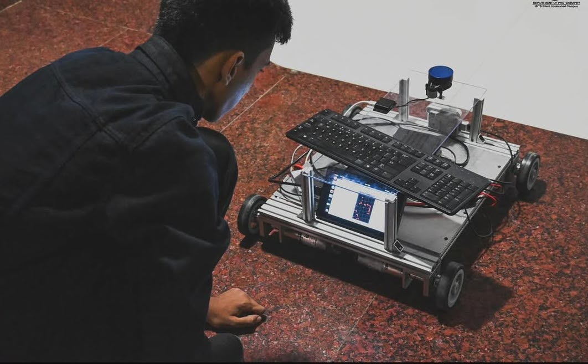

# Beetle: A Heavy-Duty Autonomous Testbed for ROS 2 Navigation

**Abstract:** Beetle is a robust, 4-wheeled skid-steer autonomous ground vehicle (AGV) designed as a research testbed for the Automation and Robotics Club of BITS Pilani, Hyderabad Campus (ARC BPHC). Built to carry a 60kg payload, it runs on ROS 2 Humble and has a bunch of sensors (LiDAR, RGB-D Camera, and Fisheye lens tracking Camera) to execute SLAM and Path Planning.

---

## 1. Introduction: The Need for a Platform

Learning ROS (Robot Operating System) in simulation is valuable, but I wanted to make something that could be used in the real world. At the time, the robotics club that I am a part of, need a testbed for trying out SLAM and Path Planning algorithms on hardware. So I decided to build a robot that could serve as a long-term resource for the club.

The result was **Beetle**: a 60kg capacity skid-steer bot designed to map and navigate our department buildings.

---

## 2. Hardware Architecture

### 2.1 The Chassis & Drive
Beetle is a **4-wheeled skid-steer** vehicle. It steers by varying the speed of the left and right wheel pairs. This kinematic configuration allows for zero-radius turns, making it maneuverable in tight indoor spaces.

* **Drive System:** High-torque DC motors capable of hauling a 60kg payload.
* **Kinematics:** Differential drive controller (skid-steer logic).

### 2.2 The Compute Core
Peforming SLAM and path planning in real-time needs a computer of course.
* **Computer:** **NVIDIA Jetson AGX Xavier**.
* **OS:** Ubuntu 22.04 running **ROS 2 Humble**.

---

## 3. The Sensors

Reliable navigation requires fusing data from multiple sources. Beetle uses a multi-modal sensor setup:

| Sensor | Model | Purpose |
|--------|-------|---------|
| **LiDAR** | YDLIDAR X2 | Provides 360° 2D laser scans for LiDAR SLAM. |
| **RGB-D** | Intel RealSense D435 | Provides depth images and point clouds used for RGBD SLAM. |
| **VIO** | Intel RealSense T265 | **Visual-Inertial Odometry**. Provides very stable pose estimation for the robot. |

**Why the T265?**
Wheel odometry on skid-steer robots is inaccurate due to wheel slippage. The T265 solves this by providing Visual-Inertial Odometry that doesn't drift when the wheels slip, serving as the reliable enough `odom` frame for the navigation stack.

---

## 4. Software Stack: ROS 2 Humble

### 4.1 Localization & Mapping (SLAM)
I implemented two distinct SLAM pipelines:

1.  **LiDAR SLAM (SLAM Toolbox):** Uses the YDLIDAR X2 to create 2D occupancy grids. This is lightweight and gave good results for standard indoor navigation.

2.  **RGB-D SLAM (RTAB-Map):** Uses the RealSense D435 to generate dense 3D maps.

### 4.2 Path Planning (Nav2)
The **Nav2 stack** is what I used for this. It handles:
* **Global Planner:** Computing the shortest path from point A to point B.
* **Local Planner:** Dynamic obstacle avoidance to follow the path while dodging people or objects.

---

## 5. Conclusion

Well, Beetle worked pretty well. Now itserves as a test bed for my robotics club, allowing junior members to mess around with ROS, SLAM and Path Planning.
