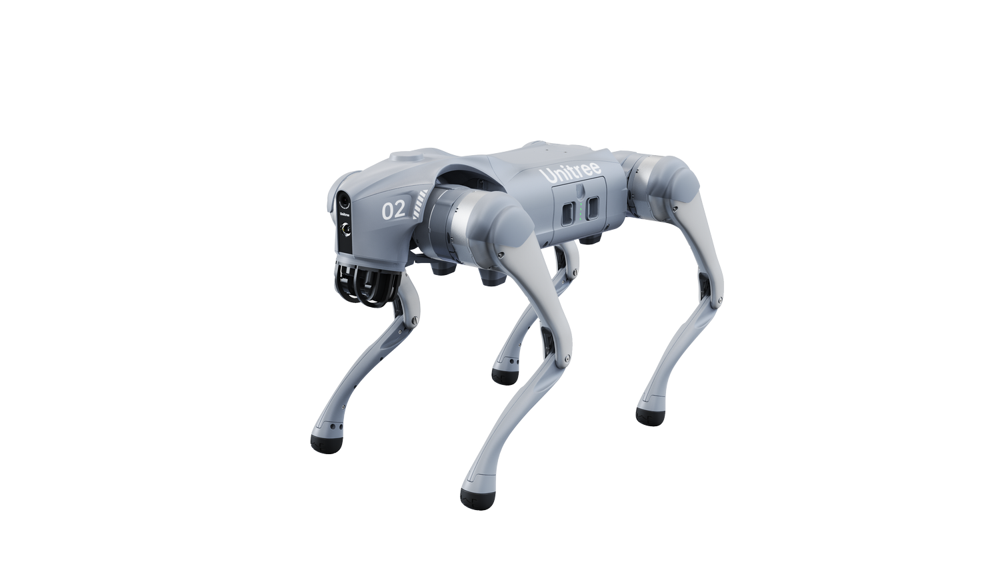

# Go2 Quadruped Locomotion Training — Project Report

## 1. Project Overview

This project implements a reinforcement learning pipeline for training the Unitree Go2 quadruped robot to perform locomotion tasks including walking, running, and jumping. The system utilizes the Genesis physics engine for simulation and the RSL-RL library for Proximal Policy Optimization (PPO) training.

### 1.1 System Architecture

The codebase consists of three primary components:

| Module | Purpose |
|--------|---------|
| `quadruped_env.py` | Simulation environment wrapping Genesis physics |
| `train.py` | Training orchestration with PPO via RSL-RL |
| `evaluate.py` / `teleop.py` | Inference and interactive control |

Training runs 4096 parallel environments on GPU, with checkpoints saved to `checkpoints/<experiment_name>/`.

---

## 2. Simulation Environment

### 2.1 Scene Construction

The simulation world is instantiated through Genesis with the following configuration:

- **Timestep**: $\Delta t = 0.02$ s (50 Hz control frequency)
- **Substeps**: 2 physics substeps per control step
- **Constraint Solver**: Newton method with collision and joint limits enabled

### 2.2 Robot Model

<div align="center">
    
    <p><em>Unitree Go2 quadruped robot</em></p>
</div>

The Go2 robot is loaded from URDF at `urdf/go2/urdf/go2.urdf`. Initial spawn configuration:

| Parameter | Value |
|-----------|-------|
| Position | $(0, 0, 0.42)$ m |
| Orientation | Identity quaternion $(1, 0, 0, 0)$ |

A ground plane is added from `urdf/plane/plane.urdf` as a fixed entity.

### 2.3 Joint Configuration

The robot has 12 actuated degrees of freedom (3 per leg):

| Leg | Joints |
|-----|--------|
| Front Right (FR) | `hip`, `thigh`, `calf` |
| Front Left (FL) | `hip`, `thigh`, `calf` |
| Rear Right (RR) | `hip`, `thigh`, `calf` |
| Rear Left (RL) | `hip`, `thigh`, `calf` |

Default standing angles $q_{default}$:

$$q_{default} = \begin{bmatrix} 0.0 & 0.8 & -1.5 & 0.0 & 0.8 & -1.5 & 0.0 & 1.0 & -1.5 & 0.0 & 1.0 & -1.5 \end{bmatrix}^T$$

Joint control uses PD position control with gains $K_p = 20.0$ and $K_d = 0.5$.

---

## 3. State and Action Spaces

### 3.1 Observation Space

The policy receives a 48-dimensional observation vector $o_t \in \mathbb{R}^{48}$:

| Component | Dimensions | Scaling Factor |
|-----------|------------|----------------|
| Body angular velocity $\omega$ | 3 | 0.25 |
| Projected gravity vector | 3 | 1.0 |
| Command vector $c$ | 5 | varies |
| Joint position error $(q - q_{default})$ | 12 | 1.0 |
| Joint velocities $\dot{q}$ | 12 | 0.05 |
| Previous action $a_{t-1}$ | 12 | 1.0 |
| Jump phase indicator | 1 | 1.0 |

The command vector contains:
$$c = \begin{bmatrix} v_x^{cmd} & v_y^{cmd} & \omega_z^{cmd} & z^{cmd} & h_{jump}^{cmd} \end{bmatrix}^T$$

### 3.2 Action Space

Actions $a_t \in \mathbb{R}^{12}$ represent residual joint position targets. The executed target is:

$$q_{target} = q_{default} + \alpha \cdot a_t$$

where $\alpha = 0.25$ is the action scaling factor. Actions are clipped to $[-100, 100]$.

### 3.3 Action Delay

The system implements one-step action delay to model real-world latency:

$$q_{executed}(t) = q_{target}(t-1)$$

---

## 4. Command Sampling

Reference commands are resampled every 4 seconds during training. Two sampling strategies are employed:

### 4.1 Uniform Sampling

| Command | Range |
|---------|-------|
| $v_x^{cmd}$ | $[-1.5, 1.5]$ m/s |
| $v_y^{cmd}$ | $[-0.8, 0.8]$ m/s |
| $\omega_z^{cmd}$ | $[-1.0, 1.0]$ rad/s |
| $z^{cmd}$ | $[0.25, 0.35]$ m |
| $h_{jump}^{cmd}$ | $[0.6, 1.0]$ m |

### 4.2 Velocity Scaling

Velocity commands are scaled based on height deviation from nominal:

$$\lambda_h = 0.5 + 0.5 \cdot \frac{|z^{cmd} - z_{nominal}|}{z_{max} - z_{nominal}}$$

$$v_{xy}^{scaled} = \lambda_h \cdot v_{xy}^{cmd}$$

---

## 5. Reward Function

The total reward is a weighted sum of individual components, each scaled by $\Delta t$:

$$R_{total} = \sum_i w_i \cdot r_i \cdot \Delta t$$

### 5.1 Velocity Tracking

**Linear velocity tracking** ($w = 1.0$):
$$r_{lin} = \exp\left( -\frac{\|v_{xy}^{cmd} - v_{xy}\|^2}{\sigma^2} \right)$$

**Angular velocity tracking** ($w = 0.5$):
$$r_{ang} = \exp\left( -\frac{(\omega_z^{cmd} - \omega_z)^2}{\sigma^2} \right)$$

where $\sigma = 0.25$ is the tracking bandwidth.

### 5.2 Regularization Terms

**Vertical velocity penalty** ($w = -2.0$):
$$r_{vz} = v_z^2 \cdot \mathbb{1}_{not\_jumping}$$

**Height tracking** ($w = -50.0$):
$$r_{height} = (z - z^{cmd})^2 \cdot \mathbb{1}_{not\_jumping}$$

**Action smoothness** ($w = -0.01$):
$$r_{smooth} = \|a_t - a_{t-1}\|^2 \cdot \mathbb{1}_{not\_jumping}$$

**Default pose similarity** ($w = -0.1$):
$$r_{pose} = \|q - q_{default}\|_1 \cdot \mathbb{1}_{not\_jumping}$$

### 5.3 Jump Rewards

Jump behavior is governed by a finite state machine with a 50-step cycle. During the peak phase (steps 15-30):

**Height tracking** ($w = 500.0$):
$$r_{jump\_h} = \exp\left( -(z - h_{jump}^{target})^2 \right) \cdot \mathbb{1}_{peak}$$

**Achievement bonus** ($w = 100.0$):
$$r_{achieve} = \mathbb{1}_{|z - h_{jump}^{target}| < 0.2} \cdot \mathbb{1}_{peak}$$

**Vertical speed** ($w = 100.0$):
$$r_{speed} = 0.2 \cdot \exp(v_z) \cdot \mathbb{1}_{peak}$$

**Landing penalty** ($w = 1.0$):
$$r_{land} = -(z - z_{nominal})^2 \cdot \mathbb{1}_{landing}$$

---

## 6. Episode Termination

Episodes terminate under the following conditions:

| Condition | Threshold |
|-----------|-----------|
| Episode timeout | $t > 1000$ steps (20 s) |
| Excessive pitch | $|\theta_{pitch}| > 10°$ |
| Excessive roll | $|\theta_{roll}| > 10°$ |

Upon termination, the environment resets joints to $q_{default}$ and base pose to initial configuration.

---

## 7. Training Configuration

### 7.1 PPO Hyperparameters

| Parameter | Value |
|-----------|-------|
| Clip parameter $\epsilon$ | 0.2 |
| Discount factor $\gamma$ | 0.99 |
| GAE parameter $\lambda$ | 0.95 |
| Learning rate | $10^{-3}$ (adaptive) |
| Mini-batches | 4 |
| Epochs per update | 5 |
| Entropy coefficient | 0.01 |
| Value loss coefficient | 1.0 |
| Max gradient norm | 1.0 |
| Target KL divergence | 0.01 |

### 7.2 Network Architecture

Both actor and critic networks use MLP architecture:

$$\text{Input}(48) \rightarrow 512 \rightarrow 256 \rightarrow 128 \rightarrow \text{Output}$$

- Activation: ELU
- Initial action noise std: 1.0

### 7.3 Training Scale

| Parameter | Value |
|-----------|-------|
| Parallel environments | 4096 |
| Steps per environment per update | 24 |
| Batch size | $4096 \times 24 = 98304$ |
| Default iterations | 1500 |
| Checkpoint interval | 100 iterations |

---

## 8. Inference and Evaluation

### 8.1 Evaluation Mode

The evaluation script loads trained checkpoints and runs single-environment inference with relaxed termination thresholds (pitch/roll limits increased to 50°). Velocity commands vary sinusoidally:

$$v_x(t) = v_{min} + \frac{v_{max} - v_{min}}{2} \left(1 + \sin\left(\frac{2\pi t}{T}\right)\right)$$

with $v_{min} = 0.5$, $v_{max} = 4.0$, and period $T = 600$ steps.

### 8.2 Teleoperation

Interactive control supports real-time command adjustment:

| Key | Action | Increment |
|-----|--------|-----------|
| W/S | Forward/backward | ±0.1 m/s |
| A/D | Lateral | ±0.1 m/s |
| Q/E | Yaw rate | ±0.1 rad/s |
| R/F | Base height | ±0.1 m |
| J | Trigger jump | — |
| U/M | Jump height | ±0.1 m |

---

## 9. File Structure

```
src/
├── quadruped_env.py    # Locomotion environment class
├── train.py            # Training entry point
├── evaluate.py         # Automated evaluation
├── teleop.py           # Keyboard teleoperation
└── checkpoints/        # Saved models and configs
    └── <exp_name>/
        ├── cfgs.pkl    # Serialized configuration
        └── model_*.pt  # Policy checkpoints
```

---

## 10. References

- Unitree Go2 Robot Documentation
- Genesis Physics Engine
- RSL-RL: Robotic Systems Lab RL Library
- Schulman et al., "Proximal Policy Optimization Algorithms," 2017
